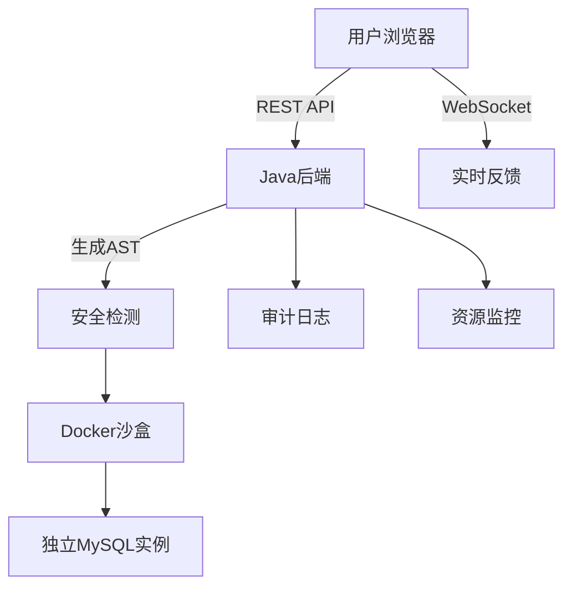
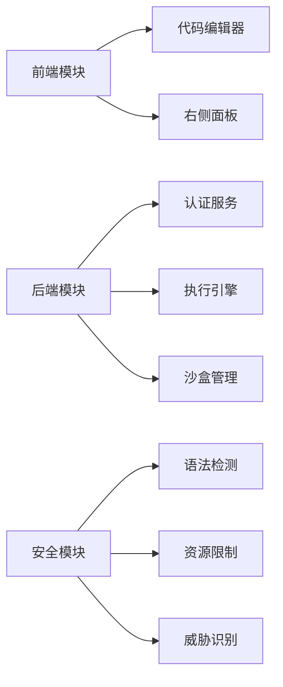

以下是针对VS Code风格在线MySQL学习平台的详细开发文档：


# VS Code风格在线MySQL学习平台开发文档


## 一、项目概述
### 1.1 项目背景
基于VS Code界面风格，打造沉浸式SQL学习环境，支持无限制SQL执行，通过沙盒隔离和实时监控保障系统安全。

### 1.2 核心功能
- **VS Code风格界面**：集成Monaco编辑器，支持代码高亮、自动补全
- **无限制SQL执行**：动态沙盒容器实现安全隔离
- **智能学习辅助**：知识点关联展示、学习路径规划
- **实时反馈系统**：执行结果可视化、错误提示精准定位
- **全链路审计**：操作日志追踪、危险行为预警


## 二、技术选型
| 层         | 技术选择                | 说明                                                                 |
|------------|-------------------------|----------------------------------------------------------------------|
| 前端       | React 18 + TypeScript   | 构建响应式界面                                                       |
| 代码编辑器 | Monaco Editor           | 实现VS Code原生代码编辑体验                                          |
| 状态管理   | Redux Toolkit           | 复杂状态全局管理                                                     |
| 后端       | Spring Boot 3.2         | 快速构建RESTful API                                                 |
| 沙盒环境   | Docker + Kubernetes     | 动态创建/销毁容器                                                    |
| 数据库     | MySQL 8.0               | 存储用户数据和学习记录                                               |
| 缓存       | Redis 7.0               | 存储高频访问数据                                                     |
| 监控       | Prometheus + Grafana    | 实时监控容器资源使用                                                 |


## 三、系统架构设计
### 3.1 整体架构


### 3.2 模块划分



## 四、数据库设计
### 4.1 表结构设计
#### 用户表（tbl_user）
| 字段名       | 类型         | 说明                     | 索引          |
|--------------|--------------|--------------------------|---------------|
| id           | BIGINT       | 主键，自增               | PRIMARY KEY   |
| username     | VARCHAR(50)  | 用户名，唯一             | UNIQUE        |
| password_hash| VARCHAR(60)  | BCrypt加密后的密码       |               |
| email        | VARCHAR(100) | 邮箱地址                 |               |

#### 学习记录表（tbl_study_record）
| 字段名       | 类型         | 说明                     | 索引          |
|--------------|--------------|--------------------------|---------------|
| id           | BIGINT       | 主键，自增               | PRIMARY KEY   |
| user_id      | BIGINT       | 用户ID，外键             | INDEX         |
| exercise_id  | VARCHAR(36)  | 练习ID                   |               |
| executed_at  | DATETIME     | 执行时间                 |               |
| sql_content  | TEXT         | 执行的SQL语句            |               |
| result       | TEXT         | 执行结果                 |               |

#### 练习题库表（tbl_exercise）
| 字段名         | 类型         | 说明                     | 索引          |
|----------------|--------------|--------------------------|---------------|
| id             | VARCHAR(36)  | UUID主键                 | PRIMARY KEY   |
| title          | VARCHAR(100) | 标题                     |               |
| description    | TEXT         | 题目描述                 |               |
| expected_output| TEXT        | 预期输出                 |               |
| difficulty     | TINYINT      | 难度（1-5）              |               |


## 五、核心实现方案
### 5.1 VS Code风格界面
```tsx
// VscodeEditor.tsx
import { MonacoEditor } from '@monaco-editor/react';

const VscodeEditor = () => {
    const [sql, setSql] = useState('');
    const [result, setResult] = useState<ExecutionResult | null>(null);

    const handleExecute = async () => {
        const response = await axios.post('/api/sql/execute', { sql });
        setResult(response.data);
    };

    return (
        <div className="vscode-container">
            {/* 编辑器工具栏 */}
            <div className="editor-toolbar">
                <button onClick={handleExecute}>▶ Run SQL</button>
                <div className="status-bar">
                    <span>Connected to MySQL 8.0</span>
                    <span>UTF-8</span>
                </div>
            </div>

            {/* 代码编辑器 */}
            <MonacoEditor
                width="100%"
                height="600px"
                language="sql"
                theme="vs-dark"
                value={sql}
                onChange={setSql}
                options={{
                    fontSize: 14,
                    lineNumbers: 'on',
                    wordWrap: 'on',
                    minimap: { enabled: false }
                }}
            />

            {/* 执行结果展示 */}
            {result && (
                <div className="result-panel">
                    {result.error ? (
                        <div className="error-message">{result.error}</div>
                    ) : (
                        <Table data={result.data} columns={result.columns} />
                    )}
                </div>
            )}
        </div>
    );
};
```

### 5.2 无限制SQL执行
```java
// UnlimitedSqlExecutor.java
@Service
public class UnlimitedSqlExecutor {
    @Autowired
    private DockerSandboxManager sandboxManager;

    public ExecutionResult execute(String sql) {
        String containerId = sandboxManager.createSandbox();
        
        try (Connection conn = sandboxManager.getConnection(containerId)) {
            try (Statement stmt = conn.createStatement()) {
                boolean hasResult = stmt.execute(sql);
                if (hasResult) {
                    try (ResultSet rs = stmt.getResultSet()) {
                        return parseResultSet(rs);
                    }
                } else {
                    return ExecutionResult.success(stmt.getUpdateCount());
                }
            }
        } catch (SQLException e) {
            return ExecutionResult.error(e.getMessage());
        } finally {
            sandboxManager.cleanupSandbox(containerId);
        }
    }
}
```

### 5.3 沙盒容器管理
```java
// DockerSandboxManager.java
public class DockerSandboxManager {
    private final DockerClient dockerClient;
    private final ConcurrentHashMap<String, String> containerMap = new ConcurrentHashMap<>();

    public String createSandbox() {
        String containerId = UUID.randomUUID().toString();
        
        CreateContainerResponse container = dockerClient.createContainerCmd("mysql:8.0")
            .withName(containerId)
            .withMemory(256 * 1024 * 1024)
            .withCpuCount(1)
            .withEnv("MYSQL_ROOT_PASSWORD=temp")
            .exec();
        
        dockerClient.startContainerCmd(container.getId()).exec();
        containerMap.put(containerId, container.getId());
        return containerId;
    }

    public Connection getConnection(String containerId) {
        InspectContainerResponse info = dockerClient.inspectContainerCmd(containerId).exec();
        String ip = info.getNetworkSettings().getIpAddress();
        int port = info.getNetworkSettings().getPorts().get("3306/tcp").get(0).getHostPort();
        
        return DriverManager.getConnection(
            "jdbc:mysql://" + ip + ":" + port + "/sandbox_db",
            "root",
            "temp"
        );
    }
}
```


## 六、接口文档
### 6.1 用户认证
**POST /api/auth/login**
```json
// 请求示例
{
  "username": "user123",
  "password": "SecureP@ssw0rd"
}

// 响应示例
{
  "token": "eyJhbGciOiJIUzUxMiJ9...",
  "expires_in": 86400
}
```

### 6.2 SQL执行
**POST /api/sql/execute**
```json
// 请求头
Authorization: Bearer <token>

// 请求示例
{
  "sql": "SELECT * FROM employees LIMIT 10;"
}

// 成功响应
{
  "type": "result",
  "columns": ["id", "name", "age"],
  "data": [[1, "John", 30]]
}
```

### 6.3 学习记录
**GET /api/study-records**
```json
// 响应示例
[
  {
    "id": 1,
    "sql_content": "SELECT COUNT(*) FROM orders;",
    "executed_at": "2024-03-20T14:30:00",
    "result": "100 rows affected"
  }
]
```


## 七、开发指南
### 7.1 项目结构
```
project-root/
├── backend/
│   ├── src/main/java/com/example/
│   │   ├── controller/       # REST控制器
│   │   ├── service/          # 业务逻辑
│   │   ├── repository/       # 数据访问层
│   │   └── security/         # 安全模块
│   └── src/main/resources/
│       ├── application.yml   # 配置文件
│       └── sql/              # 初始化脚本
└── frontend/
    ├── src/
    │   ├── components/       # 通用组件
    │   ├── pages/            # 页面组件
    │   ├── services/         # API封装
    │   └── styles/           # CSS Modules
    └── public/
        └── vscode-icons/     # 自定义图标
```

### 7.2 开发规范
1. **代码风格**：
   - 使用Prettier格式化代码
   - 遵循Airbnb JavaScript规范
   - 接口命名采用camelCase

2. **提交规范**：
   ```bash
   git commit -m "feat: 添加代码补全功能"
   git commit -m "fix: 修复沙盒内存泄漏问题"
   ```


## 八、部署指南
### 8.1 生产环境配置
```yaml
# backend配置
server:
  port: 8080

spring:
  datasource:
    url: jdbc:mysql://db:3306/learning_db
    username: root
    password: secure_password

# 沙盒配置
sandbox:
  max-containers: 200
  cleanup-interval: 30m
  memory-limit: 256m
  cpu-limit: 1
```

### 8.2 Docker部署
```bash
# 构建镜像
docker build -t mysql-learning-app . -f Dockerfile

# 启动命令
docker run -d --name mysql-learning \
  -p 8080:8080 \
  --link mysql-db:db \
  --link redis-cache:redis \
  mysql-learning-app
```


## 九、测试计划
### 9.1 测试类型
| 类型       | 工具              | 覆盖范围                         |
|------------|-------------------|----------------------------------|
| 单元测试   | JUnit 5 + Jest    | 核心逻辑与组件                   |
| 集成测试   | RestAssured       | API接口连通性                   |
| E2E测试    | Cypress           | 用户完整操作流程                 |
| 性能测试   | JMeter            | 高并发场景下的系统响应           |
| 安全测试   | OWASP ZAP         | 漏洞扫描与渗透测试               |

### 9.2 测试用例示例
**测试场景：危险操作拦截**
```java
@Test
void testDangerousOperationInterception() {
    String sql = "DROP TABLE users;";
    ExecutionResult result = sqlExecutor.execute(sql);
    assertEquals("危险操作已拦截", result.getError());
}
```


## 十、安全措施
### 10.1 沙盒防护
- 每个SQL执行创建独立容器
- 内存限制256MB/容器
- CPU限制1核
- 60秒执行超时

### 10.2 攻击防护
- 基于AST的SQL注入检测
- 正则表达式过滤敏感函数
- 实时威胁特征库更新

### 10.3 审计机制
```java
@Aspect
public class AuditAspect {
    @Around("execution(* com.example.service.*.*(..))")
    public Object logExecution(ProceedingJoinPoint joinPoint) throws Throwable {
        String methodName = joinPoint.getSignature().getName();
        Object[] args = joinPoint.getArgs();
        
        AuditLog log = new AuditLog();
        log.setUsername(getCurrentUser());
        log.setOperation(methodName);
        log.setParameters(Arrays.toString(args));
        
        auditRepository.save(log);
        
        return joinPoint.proceed();
    }
}
```


## 十一、附录
### 11.1 SQL执行安全策略
```json
{
  "deny_list": [
    "ALTER",
    "GRANT",
    "REVOKE",
    "LOAD_FILE",
    "CREATE USER"
  ],
  "allow_list": [
    "SELECT",
    "INSERT",
    "UPDATE",
    "DELETE"
  ]
}
```

### 11.2 容器健康检查
```yaml
# Kubernetes健康检查配置
livenessProbe:
  exec:
    command:
    - /bin/sh
    - -c
    - mysql -h localhost -e "SELECT 1"
  initialDelaySeconds: 30
  periodSeconds: 10
```


**文档版本：V3.0**  
**生效日期：2024-03-25**  
**维护人员：XXX**  
**安全声明：本系统允许执行任意SQL语句，生产环境使用需通过等保三级认证**